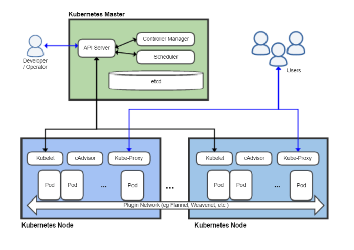

M300 - 40 Kubernetes (K8s)
==========================

Diese Wikiseite zeigt beinhaltet eine kleine Einführung in Kubernetes.

#### Lernziele

Sie können einen einfachen Kubernetes Kluster aufsetzen.

#### Voraussetzungen

* [10 Toolumgebung](../10-Toolumgebung/)

#### Inhaltsverzeichnis
* 01 - [Infrastructure as Code](#-01---kubernetes)
* 02 - [Vagrant](#-01---kubernetes-cluster)
* 03 - [Fazit / Reflexion](#-04---reflexion--fragen)
* 04 - [Quellenverzeichnis](#-04---quellenverzeichnis)

 01 - Kubernetes
======

> [⇧ **Nach oben**](#inhaltsverzeichnis)

Kubernetes (auch als „K8s“ oder einfach „K8“ bezeichnet - *sprich immer: 'Kuhbernetties'*) ist ein Open-Source-System zur Automatisierung der Bereitstellung, Skalierung und Verwaltung von Container-Anwendungen, das ursprünglich von Google entworfen und an die Cloud Native Computing Foundation gespendet wurde. Es zielt darauf ab, eine „Plattform für das automatisierte Bespielen, Skalieren und Warten von Anwendungscontainern auf verteilten Hosts“ zu liefern. Es unterstützt eine Reihe von Container-Tools, einschließlich Docker.

Die Orchestrierung mittels Kubernetes wird von führenden Cloud-Plattformen wie Microsofts Azure, IBMs Bluemix, Red Hats OpenShift und Amazons AWS unterstützt.

### Merkmale
***

* Immutable (Unveränderlich) statt Mutable.
* Deklarative statt Imperative (Ausführen von Anweisungen) Konfiguration.
* Selbstheilende Systeme - Neustart bei Absturz.
* Entkoppelte APIs – LoadBalancer / Ingress (Reverse Proxy).
* Skalieren der Services durch Änderung der Deklaration.
* Anwendungsorientiertes statt Technik (z.B. Route 53 bis AWS) Denken.
* Abstraktion der Infrastruktur statt in Rechnern Denken.

### Objekte
***

* **Pod** - Ein Pod repräsentiert eine Gruppe von Anwendungs-Containern und Volumes,
die in der gleichen Ausführungsumgebung (gleiche IP, Node) laufen.
* **ReplicaSet**: ReplicaSets bestimmen wieviele Exemplare eines Pods laufen und stellen sicher, dass die angeforderte Menge auch verfügbar ist. 
* **Deployment**: Erweitern ReplicaSets um deklarative Updates (z.B. von Version 1 auf 1.1) von Pods.
* **Service**: Ein Service (manchmal auch als Microservice bezeichnet) steuert den Zugriff auf einen Pod (IP-Adresse, Port). Während Pods ersetzt werden können (z.B. durch Update auf neue Version) bleibt ein Service stabil.
* **Ingress**: Ähnlich einem Reverse Proxy ermöglicht ein Ingress den Zugriff auf einen Service über einen URL.

### Installation
***

Für die Installation verwenden Sie die Anleitung vom Projekt:

* [Docker und Kubernetes – Übersicht und Einsatz](https://github.com/mc-b/duk)

### Beispiel YAML Datei
***

Ein Apache Web Server kann wie folgt Bereitgestellt werden:
	
	apiVersion: v1
	kind: Service
	metadata:
	  name: apache
	  labels:
	    app: apache
	    group: web
	    tier: frontend
	spec:
	  type: LoadBalancer
	  ports:
	  - port: 80
	    protocol: TCP
	  selector:
	    app: apache
	---
	
	apiVersion: apps/v1beta2 # for versions before 1.8.0 use apps/v1beta1
	kind: Deployment
	metadata:
	  name: apache
	spec:
	  replicas: 1
	  selector:
	    matchLabels:
	      app: apache
	  template:
	    metadata:
	      labels:
	        app: apache
	        group: web
	        tier: frontend
	    spec:
	      containers:
	      - name: apache
	        image: httpd
	        ports:
	        - containerPort: 80
	          name: apache
	          
### Links

* [Homepage](http://kubernetes.io)
* [Beispiele](https://github.com/mc-b/duk)

 02 - Kubernetes Cluster
======

> [⇧ **Nach oben**](#inhaltsverzeichnis)

Quelle: <a href="https://elastisys.com/2018/01/25/setting-highly-available-kubernetes-clusters/">On setting up highly available Kubernetes clusters</a>

- - -

Bei einem Cluster wird ein Kubernetes Master und mehrere Worker erzeugt. Diese Umgebung eignet sich zur Demonstration einer Verteilten Umgebung.

**Voraussetzungen**

Genügend GB RAM für alle VM's, z.B. können bei einem 32 GB RAM System ca. 7 VM's à 4 GB RAM eingerichtet werden.

### Konfiguration
***

Siehe Datei [cluster-large.yaml](https://github.com/mc-b/lernkube/blob/master/templates/cluster-large.yaml) oder [cluster-small.yaml](https://github.com/mc-b/lernkube/blob/master/templates/cluster-small.yaml).

Die wichtigsten Konfigurationen:

	master:
	  count: 1
	  cpus: 2
	  memory: 5120
	worker:
	  count: 2

Es wird ein Master und zwei Worker Nodes erstellt. Der Master und die Worker Nodes werden während der Installation automatisch miteinnander gejoint.

	use_dhcp: false  
	ip:
	  master:   192.168.178.200
	  worker:   192.168.178.201
	net:
	  network_type: public_network
	  default_router: "route add default gw 192.168.178.1 enp0s8 && route del default gw 10.0.2.2 enp0s3"	  

Die IP-Adressen werden fix vergeben. Bei fixer IP-Adressen Vergabe, muss ein "Default Router" gesetzt sein, ebenfalls muss ein "Public Network" verwendet werden. Ansonsten finden sich zwar Master und Worker, können aber nicht miteinnander kommunizieren.

 03 - Reflexion / Fragen
======

> [⇧ **Nach oben**](#inhaltsverzeichnis)

 04 - Quellenverzeichnis
====== 	

> [⇧ **Nach oben**](#inhaltsverzeichnis)

                  
	                  